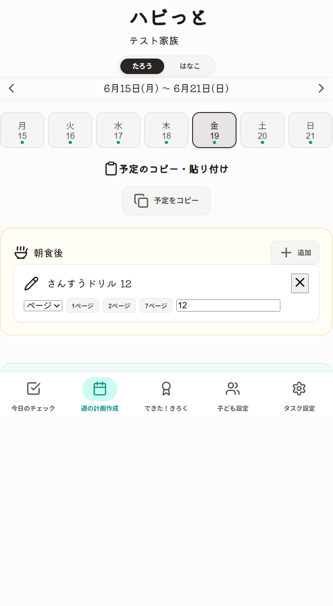
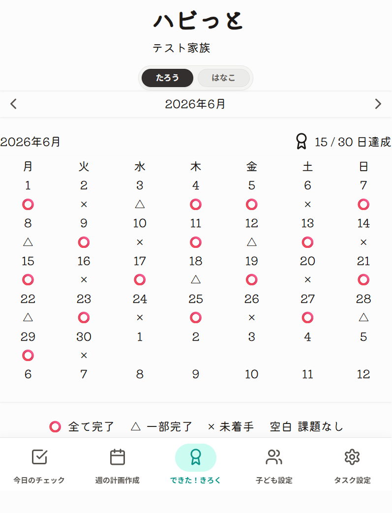
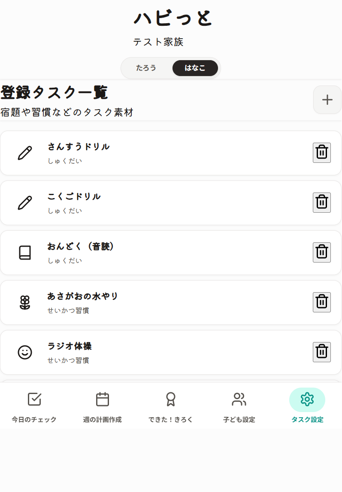
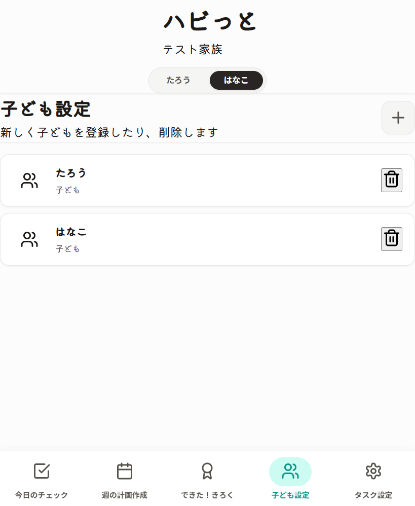

# Monorepo Starter Kit (Hono + Vite + Zod)

このプロジェクトは、**Hono (Backend)**, **Vite/React (Frontend)**, **Zod (Shared)** を組み合わせた、型安全なフルスタック開発のための最小構成テンプレートです。

## 🚀 クイックスタート

### 1. 依存関係のインストール
```bash
npm install
```

### 2. 開発サーバーの起動
```bash
# Backend (Hono)
npm run dev:backend

# Frontend (Vite)
npm run dev:frontend
```

起動後のアクセス先は次のとおりです。

- Frontend: http://localhost:5173/
- Backend: http://127.0.0.1:8787/

ルートの `package.json` には、以下の開発用スクリプトがあります。

- `npm run dev:backend` - Cloudflare Workers / Hono のローカル起動
- `npm run dev:frontend` - Vite / React のローカル起動
- `npm run build` - 全 workspace のビルド
- `npm run typecheck` - TypeScript の型チェック

### 3. 型チェック
```bash
npm run typecheck
```

## 🖼 画面サンプル

ローカル起動した画面をもとに、主要な画面のサンプル画像を用意しています。

| 画面 | 説明 | 画像 |
| --- | --- | --- |
| 今日のチェック | その日の朝食・昼食・夕食ごとに、タスクの完了状況を確認します。 |  |
| 週の計画作成 | 1週間の予定を切り替えながら、タスクのコピーや貼り付けを行います。 |  |
| できた！きろく | 月ごとの達成状況をカレンダーで確認します。子どもごとの進捗を俯瞰できます。 |  |
| タスク設定 | 子どもごとのタスクマスターを追加・削除します。 |  |
| 子ども設定 | 家庭に紐づく子どもの登録や削除を行います。 |  |

サンプル画像は、`npm run dev:frontend` で起動した画面をローカルで撮影したものです。

## 📘 ユーザー向け使い方手順書

実際に触りながら使い方を確認したい場合は、[docs/usage-guide.md](docs/usage-guide.md) を参照してください。印刷しやすい [PDF 版](docs/usage-guide.pdf) も用意しています。

## 🤖 AIを用いたプロジェクトの始め方 (Vibe Coding)

このテンプレートをクローンした後、**手動でファイル名やDB設定を書き換える必要はありません**。
Cursor や Cline（Antigravity）などの AI エージェントに以下の「キックオフ・プロンプト」を投げるだけで、面倒な初期化作業から最初のデータ設計までを全自動で完了してくれます。

### 1. キックオフ・プロンプトの送信
エディタ（AIエージェント）を開き、以下のプロンプトの `【】` の部分を今回のアイデアに合わせて書き換え、最初の指示として送信してください。

```text
これから新しいWebアプリケーションの開発を始めます。
まずは `.agent/rules/` にあるルールファイル（architecture.md と cloude.md）を熟読し、このプロジェクトのアーキテクチャ（Hono+Vite+Zodのモノレポ）と開発作法を完全に理解してください。

【プロジェクト概要】
今回は「【ここにアプリの概要を書く。例：50人の学生の就職活動状況を管理するアプリ】」を作ります。
プロジェクト名は `【プロジェクト名】` 、DB名は `【DB名】` とします。

【最初のタスク】
ルールの「Standard Development Workflow」に従い、以下の手順で作業を開始してください。

1. プロジェクトの初期化（名義変更とDB作成）:
   - ルートおよび各 package (frontend, backend, shared) の `package.json` の "name" を今回のプロジェクト名に合わせて変更してください（必要に応じて @スコープ名 を使用）。
   - `packages/backend/wrangler.toml` の `name` を今回のプロジェクト名に、`database_name` を今回のDB名に書き換えてください。
   - `packages/backend` に移動し、ターミナルで `npx wrangler d1 create <今回のDB名>` を実行してください。
   - 出力された `database_id` を、先ほど書き換えた `wrangler.toml` に反映してください。

2. スキーマの設計:
   - このアプリのコアとなるデータ構造の Zod スキーマ案を `packages/shared/src/schemas/` に作成し、私に提案してください。
   - 最後に `shared/src/index.ts` からそれらを一括 export するのを忘れないでください。

まだAPIやUIの実装には進まず、プロジェクトの初期化とZodスキーマの提案が完了した時点で報告してください。
```

### 2. 設計（Schema）のレビューと開発開始
エージェントがプロジェクトの設定を終わらせ、Zod スキーマ（データベースのテーブルと型の設計図）を提案してきます。
必要な項目（例：「選考ステータスに『辞退』も足して」など）をレビュー・修正し、スキーマが確定したら、以下の指示を出して本格的な開発をスタートさせましょう！

> 「OK、そのスキーマで DBのマイグレーションファイルと、バックエンドの CRUD API を実装して」

## 📂 フォルダ構成と役割
このプロジェクトは **npm workspaces** を使用したモノレポ構成です。

### 1. packages/shared (型の源泉)
Backend と Frontend で共有するビジネスロジックやバリデーション、型定義を配置します。

- **src/schemas/**: Zod スキーマ（バリデーションの実体）を配置します。
- **src/types/**: スキーマから推論された TypeScript 型（z.infer）を配置します。
- **src/index.ts**: 各パッケージへ公開するためのエントリポイントです。

> [!TIP]
> 「型優先（Type-First）」の開発を行うため、まずはここから着手するのが理想的です。

### 2. packages/backend (Hono API)
Cloudflare Workers / D1 環境で動作する API サーバーです。

- **src/index.ts**: API のルート定義。AppType をエクスポートすることで、Frontend から RPC による型安全な呼び出しが可能になります。
- **migrations/**: Cloudflare D1 などのデータベースマイグレーション用 SQL ファイルを配置します。
- **wrangler.toml**: 開発環境やデプロイに関する設定ファイルです。

### 3. packages/frontend (Vite / React)
Hono RPC クライアントを備えた React アプリケーションです。

- **src/lib/hc.ts**: Hono Client の初期設定。Backend の AppType を参照し、エンドツーエンドの型安全性を担保します。
- **src/main.tsx**: アプリケーションのエントリポイントです。

## 🛠 開発ガイドライン
### 型安全な通信 (Hono RPC)
Frontend から Backend への通信は、`fetch` や `axios` ではなく、`packages/frontend/src/lib/hc.ts` で設定されたクライアントを使用してください。これにより、API のエンドポイント名や型、パラメータの補完が効くようになります。

### AI 開発のルール
AI アシスタント（Cursor など）が開発の作法を理解するために、以下のルールファイルが用意されています：

- **.agent/rules/cloude.md**: 開発プロトコルと AI への指示。
- **.cursorrules**: Cursor 全体への指示（型優先、RPC 推奨など）。
